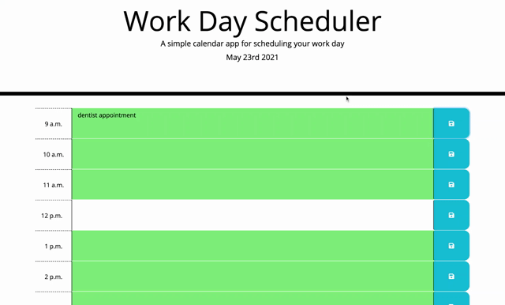

# Work-Day Calandar 
A simple calandar application that allows users to save events for the day on an hour to hour basis.

## table of contents 
- [Purpose](#purpose)
- [Technologies-Used](#Technologies-Used)
- [Getting-started](#Getting-started)
- [Contact](#Contact)

## purpose
A simple calandar application that allows users to save events for the day on an hour to hour basis. The app displays the current date at the top of the calendar and each time block is color-coded to indicate whether the task is in the past, present, or future. The app runs on the browser and is powered by jQuery.

## Technologies-Used
* HTML
* CSS
* Javascript
* jQuery
* Moment.js library

## Getting-started
To run the application on your computer simply clone the code and open the index.html page on your prefered browser or you can view the deployed application at the following link https://araceli4690.github.io/work-day-scheduler/

- mock-up of application

## Contact
If you have any questions feel free to contact me through my [Github](https://github.com/Araceli4690).